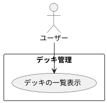

# デッキの一覧表示

## 履歴

| バージョン |    日付    | 変更内容 | 担当者 |
| :--------: | :--------: | :------- | :----: |
|   0.0.1    | 2024/07/04 | 新規作成 |        |

## 詳細

### アクター

ユーザー

### 目的

ユーザーが自身の登録したデッキを一覧表示して確認できるようにする。

### 前提条件

- ユーザーがアカウントにログインしている。
- ユーザーが少なくとも1つのデッキを登録している。

### 事後条件

- ユーザーが登録したデッキの一覧を表示できる。
- ユーザーが各デッキの詳細情報（デッキ名、カードリスト）を確認できる。

### トリガー

ユーザーが「デッキ管理」画面を開く。

### 主成功シナリオ

1. ユーザーがアプリの「デッキ管理」画面を開く。
2. アプリがユーザーの登録したデッキの一覧を表示する。
3. ユーザーが各デッキの概要（デッキ名、登録日など）を確認する。
4. ユーザーが特定のデッキを選択すると、アプリがそのデッキの詳細情報（カードリストなど）を表示する。

### 代替フロー

- ***デッキが登録されていない場合*** 
・2a. アプリが「デッキが登録されていません」というメッセージを表示する。 
・2b. ユーザーが「新規デッキ登録」ボタンを押して、新しいデッキを登録する。

### 例外フロー

- ***ネットワークエラーが発生した場合*** 
・2c. アプリがネットワークエラーを検出した場合、ユーザーにエラーメッセージを表示し、後で再試行するように促す。 
・2d. ユーザーが「再試行」ボタンを押して、デッキの一覧表示を再試行する。

### ユースケース　図

