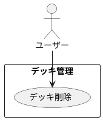

# デッキの削除

## 履歴

| バージョン |    日付    | 変更内容 | 担当者 |
| :--------: | :--------: | :------- | :----: |
|   0.0.1    | 2024/07/03 | 新規作成 |        |

## 詳細

### アクター

ユーザー

### 目的

ユーザーが既存のデッキをアプリから削除できるようにする。

### 前提条件

- ユーザーがアカウントにログインしている。
- ユーザーが削除したいデッキを既に登録している。

### 事後条件

- デッキがユーザーのアカウントから削除される。
- デッキの情報がデータベースから削除される。

### トリガー

ユーザーが削除したいデッキを選択し、「削除」ボタンを押す。

### 主成功シナリオ

1. ユーザーがアプリの「デッキ管理」画面を開く。
2. ユーザーが削除したいデッキを一覧から選択する。
3. ユーザーが「削除」ボタンを押す。
4. アプリがユーザーに削除確認メッセージを表示する。
5. ユーザーが「確認」ボタンを押す。
6. アプリがデッキの情報をデータベースから削除する。
7. アプリがユーザーにデッキ削除成功のメッセージを表示する。
8. デッキがデッキ一覧から削除される。

### 代替フロー

- ***ユーザーが削除をキャンセルする場合*** 
・4a. ユーザーが削除確認メッセージで「キャンセル」ボタンを押す。 
・4b. アプリが削除プロセスを中止し、元の画面に戻る。

### 例外フロー

- ***ネットワークエラーが発生した場合*** 
・6a. アプリがネットワークエラーを検出した場合、ユーザーにエラーメッセージを表示し、後で再試行するように促す。 
・6b. ユーザーが「キャンセル」ボタンを押して削除プロセスを中止する。

