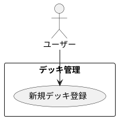

# デッキの新規登録

## 履歴

| バージョン |    日付    | 変更内容 | 担当者 |
| :--------: | :--------: | :------- | :----: |
|   0.0.1    | 2024/07/03 | 新規作成 |        |

## 詳細

### アクター

ユーザー

### 目的

ユーザーが新しいデッキをアプリに登録できるようにする。

### 前提条件

- ユーザーがアカウントにログインしている。

### 事後条件

- 新しいデッキがユーザーのアカウントに登録され、デッキ一覧に表示される。
- デッキの情報がデータベースに保存される。

### トリガー

ユーザーが「新規デッキ登録」ボタンを押す。

### 主成功シナリオ

1. ユーザーがアプリの「デッキ管理」画面を開く。
2. ユーザーが「新規デッキ登録」ボタンを押す。
3. アプリがユーザーにデッキ登録フォームを表示する。
4. ユーザーが以下の情報を入力する: 
・デッキ名 
・カードリスト（カード名、枚数）
5. ユーザーが「保存」ボタンを押す。
6. アプリが入力内容を検証する。
7. 入力内容が有効であれば、新しいデッキがデータベースに保存される。
8. アプリがユーザーにデッキ登録成功のメッセージを表示する。
9. 新しいデッキがデッキ一覧に表示される。

### 代替フロー

- ***入力内容が無効な場合*** 
・6a. アプリが入力内容の検証に失敗した場合、ユーザーにエラーメッセージを表示し、適切なフィールドを強調表示する。 
・6b. ユーザーがエラーメッセージに基づいて入力内容を修正する。 
・6c. ユーザーが再度「保存」ボタンを押し、ステップ6に戻る。

- ***カードリストが不完全な場合*** 
・6d. アプリがカードリストの不完全さを検出した場合、ユーザーにエラーメッセージを表示する。 
・6e. ユーザーがカードリストを修正する。 
・6f. ユーザーが再度「保存」ボタンを押し、ステップ6に戻る。

### 例外フロー

- ***ネットワークエラーが発生した場合*** 
・7a. アプリがネットワークエラーを検出した場合、ユーザーにエラーメッセージを表示し、後で再試行するように促す。 
・7b. ユーザーが「キャンセル」ボタンを押して登録プロセスを中止する。

## ユースケース図

