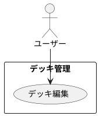

# デッキの新規登録

## 履歴

| バージョン |    日付    | 変更内容 | 担当者 |
| :--------: | :--------: | :------- | :----: |
|   0.0.1    | 2024/07/03 | 新規作成 |        |

## 詳細

### アクター

ユーザー

### 目的

ユーザーが既存のデッキの情報を編集・更新できるようにする。

### 前提条件

- ユーザーがアカウントにログインしている。
- ユーザーが編集したいデッキを既に登録している。

### 事後条件

- デッキの情報が更新され、データベースに保存される。
- 更新されたデッキ情報がデッキ一覧に反映される。

### 主成功シナリオ

1. ユーザーがアプリの「デッキ管理」画面を開く。
2. ユーザーが編集したいデッキを一覧から選択する。
3. ユーザーが「編集」ボタンを押す。
4. アプリがユーザーにデッキ編集フォームを表示する。
5. ユーザーが以下の情報を編集する: 
・デッキ名 
・カードリスト（カード名、枚数）
6. ユーザーが「保存」ボタンを押す。
7. アプリが入力内容を検証する。
8. 入力内容が有効であれば、デッキの情報がデータベースに保存される。
9. アプリがユーザーにデッキ編集成功のメッセージを表示する。
10. 更新されたデッキ情報がデッキ一覧に反映される。

### 代替フロー

- ***入力内容が無効な場合*** 
・7a. アプリが入力内容の検証に失敗した場合、ユーザーにエラーメッセージを表示し、適切なフィールドを強調表示する。 
・7b. ユーザーがエラーメッセージに基づいて入力内容を修正する。 
・7c. ユーザーが再度「保存」ボタンを押し、ステップ7に戻る。

- ***カードリストが不完全な場合*** 
・7d. アプリがカードリストの不完全さを検出した場合、ユーザーにエラーメッセージを表示する。 
・7e. ユーザーがカードリストを修正する。 
・7f. ユーザーが再度「保存」ボタンを押し、ステップ7に戻る。

### 例外フロー

- ***ネットワークエラーが発生した場合*** 
・8a. アプリがネットワークエラーを検出した場合、ユーザーにエラーメッセージを表示し、後で再試行するように促す。 
・8b. ユーザーが「キャンセル」ボタンを押して編集プロセスを中止する。

## ユースケース図

