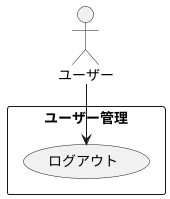

# ユーザーログアウト

## 履歴

| バージョン |    日付    | 変更内容 | 担当者 |
| :--------: | :--------: | :------- | :----: |
|   0.0.1    | 2024/07/03 | 新規作成 |        |

## 詳細

### アクター

ユーザー

### 目的

ユーザーが安全にアカウントからログアウトし、セッションを終了する。

### 前提条件

- ユーザーがアカウントにログインしている。

### 事後条件

- ユーザーのセッションが終了し、ログイン画面にリダイレクトされる。
- ユーザーのセッション情報がサーバーから削除される。

### トリガー

ユーザーがアプリの「ログアウト」ボタンを押す。

### 主成功シナリオ

1. ユーザーがアプリのナビゲーションメニューから「ログアウト」ボタンを押す。
2. アプリがユーザーにログアウト確認メッセージを表示する。
3. ユーザーが「確認」ボタンを押す。
4. アプリがユーザーのセッションを終了する。
5. アプリがユーザーのセッション情報をサーバーから削除する。
6. ユーザーがログイン画面にリダイレクトされる。
7. アプリがユーザーにログアウト成功のメッセージを表示する。

### 代替フロー

- ***ユーザーがログアウトをキャンセルする場合*** 
・2a. ユーザーがログアウト確認メッセージで「キャンセル」ボタンを押す。 
・2b. アプリがログアウトプロセスを中止し、元の画面に戻る。

### 例外フロー

- ***ネットワークエラーが発生した場合*** 
・4a. アプリがネットワークエラーを検出した場合、ユーザーにエラーメッセージを表示し、後で再試行するように促す。 
・4b. ユーザーが「キャンセル」ボタンを押してログアウトプロセスを中止する。

## ユースケース図

