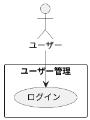

# ユーザーログイン

## 履歴

| バージョン |    日付    | 変更内容 | 担当者 |
| :--------: | :--------: | :------- | :----: |
|   0.0.1    | 2024/07/02 | 新規作成 |        |

## 詳細

### アクター

ユーザー

### 目的

ユーザーが既存のアカウントにログインし、アプリの機能にアクセスできるようにする。

### 前提条件

- ユーザーが既にアカウントを作成している。

### 事後条件

- ユーザーが正常にログインし、ダッシュボードにアクセスできる。
- ユーザーのセッション情報がサーバーに保存される。

### 主成功シナリオ

1. ユーザーがアプリを開き、「ログイン」ボタンを押す。
2. アプリがユーザーにログインフォームを表示する。
3. ユーザーが以下の情報を入力する: 
・メールアドレス 
・パスワード（8文字以上、少なくとも1つの数字および1つの特殊文字を含む）
4. ユーザーが「ログイン」ボタンを押す。
5. アプリが入力内容を検証する。
6. 入力内容が有効であれば、ユーザーのセッションを開始する。
7. アプリがユーザーにログイン成功のメッセージを表示する。
8. ユーザーがダッシュボードにリダイレクトされる。

### 代替フロー

- ***入力内容が無効な場合*** 
・5a. アプリが入力内容の検証に失敗した場合、ユーザーにエラーメッセージを表示し、適切なフィールドを強調表示する。 
・5b. ユーザーがエラーメッセージに基づいて入力内容を修正する。 
・5c. ユーザーが再度「ログイン」ボタンを押し、ステップ5に戻る。

- ***メールアドレスまたはパスワードが間違っている場合*** 
・6a. アプリがメールアドレスまたはパスワードの誤りを検出した場合、ユーザーにエラーメッセージを表示する。 
・6b. ユーザーが正しい情報を入力する。 
・6c. ユーザーが再度「ログイン」ボタンを押し、ステップ5に戻る。 

### 例外フロー

- ***ネットワークエラーが発生した場合*** 
・5d. アプリがネットワークエラーを検出した場合、ユーザーにエラーメッセージを表示し、後で再試行するように促す。 
・5e. ユーザーが「キャンセル」ボタンを押してログインプロセスを中止する。 

