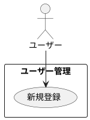

# ユーザー新規登録

## 履歴

| バージョン |    日付    | 変更内容 | 担当者 |
| :--------: | :--------: | :------- | :----: |
|   0.0.1    | 2024/07/02 | 新規作成 |        |

## 詳細

### アクター

 ユーザー

### 目的

ユーザーが新規アカウントを作成し、アプリにアクセスできるようにする。

### 前提条件

- ユーザーがアプリをダウンロードし、インストールしている。

### 事後条件

- ユーザーのアカウントが作成され、ログイン可能となる。
- ユーザーの情報がデータベースに保存される。

### トリガー

ユーザーがアプリの「新規登録」ボタンを押す。

### 主成功シナリオ

1. ユーザーがアプリを開き、「新規登録」ボタンを押す。
2. アプリがユーザーに登録フォームを表示する。
3. ユーザーが以下の情報を入力する: 
・ユーザー名 
・パスワード（8文字以上、少なくとも1つの数字および1つの特殊文字を含む）
4. ユーザーが「登録」ボタンを押す。
5. アプリが入力内容を検証する。
6. 入力内容が有効であれば、アカウントが作成される。
7. アプリがユーザーにアカウント作成成功のメッセージを表示する。
8. ユーザーが自動的にログインされ、ダッシュボードにリダイレクトされる。

### 代替フロー

- **入力内容が無効な場合:** 
・5a. アプリが入力内容の検証に失敗した場合、ユーザーにエラーメッセージを表示し、適切なフィールドを強調表示する。 
・5b. ユーザーがエラーメッセージに基づいて入力内容を修正する。 
・5c. ユーザーが再度「登録」ボタンを押し、ステップ5に戻る。

- **メールアドレスが既に使用されている場合:** 
・6a. アプリがメールアドレスの重複を検出した場合、ユーザーにエラーメッセージを表示する。 
・6b. ユーザーが別のメールアドレスを入力する。 
・6c. ユーザーが再度「登録」ボタンを押し、ステップ5に戻る。

### 例外フロー

- ***ネットワークエラーが発生した場合*** 
・5d. アプリがネットワークエラーを検出した場合、ユーザーにエラーメッセージを表示し、後で再試行するように促す。 
・5e. ユーザーが「キャンセル」ボタンを押して登録プロセスを中止する。

## ユースケース図

