# ユースケース

## 目次

- [ユースケース](#ユースケース)
  - [目次](#目次)
  - [履歴](#履歴)
  - [ユースケース一覧](#ユースケース一覧)
    - [1. ユーザー管理](#1-ユーザー管理)
    - [2. デッキ管理](#2-デッキ管理)
    - [3. 対戦相手管理](#3-対戦相手管理)
    - [4. 対戦記録](#4-対戦記録)
    - [5. 振り返り機能](#5-振り返り機能)
    - [6. 分析機能](#6-分析機能)
    - [7. 通知機能](#7-通知機能)
    - [8. データ同期](#8-データ同期)
    - [9. ユーザーインターフェース](#9-ユーザーインターフェース)
    - [10. コミュニティ機能](#10-コミュニティ機能)
  - [ユースケース図](#ユースケース図)

## 履歴

| バージョン |    日付    | 変更内容 | 担当者 |
| :--------: | :--------: | :------- | :----: |
|   0.0.1    | 2024/07/01 | 新規作成 |        |

## ユースケース一覧

### 1. ユーザー管理

> [!CAUTION]
> 優先度：***高***

1. [ユーザー新規登録](./ユーザー管理/新規登録機能.md)  
ユーザーが新しいアカウントを作成する。

2. [ユーザーログイン](./ユーザー管理/ユーザーログイン.md)  
ユーザーが既存のアカウントにログインする。

3. [ユーザーログアウト](./ユーザー管理/ユーザーログアウト.md)  
ユーザーがアカウントからログアウトする。

### 2. デッキ管理

> [!CAUTION]
> 優先度：***高***

1. [デッキの新規登録](./デッキ管理/デッキの新規登録.md) 
ユーザーが新しいデッキを作成・登録する。

2. [デッキの編集](./デッキ管理/デッキの編集.md) 
ユーザーが既存のデッキを編集する。

3. [デッキの削除](./デッキ管理/デッキの削除.md) 
ユーザーが不要なデッキを削除する。

4. [デッキの一覧表示](./デッキ管理/デッキの削除.md) 
ユーザーが登録済みのデッキを一覧表示する。

### 3. 対戦相手管理

> [!WARNING]
> 優先度：***中***

1. 対戦相手の新規登録 
ユーザーが新しい対戦相手を登録する。

2. 対戦相手の編集 
ユーザーが既存の対戦相手の情報を編集する。

3. 対戦相手の削除 
ユーザーが不要な対戦相手を削除する。

4. 対戦相手の一覧表示 
ユーザーが登録済みの対戦相手を一覧表示する。

### 4. 対戦記録

> [!CAUTION]
> 優先度：***高***

1. 対戦の新規記録開始 
ユーザーが新しい対戦記録を開始する。

2. 先攻・後攻の記録 
ユーザーが対戦ごとの先攻・後攻を記録する。

3. ターン開始の記録 
ユーザーが各ターンの開始を記録する。

4. ターン終了の記録 
ユーザーが各ターンの終了を記録する。

5. サポートカードの使用記録 
ユーザーが各ターンごとのサポートカードの使用を記録する。

6. エネルギーカードの使用記録 
ユーザーが各ターンごとのエネルギーカードの使用を記録する。

7. エネルギーカードの使用記録 
ユーザーが各ターンごとのエネルギーカードの使用を記録する。

8. 勝敗の記録 
ユーザーが対戦終了時に勝敗を記録する。

9. 対戦記録の保存 
対戦終了後、対戦記録を保存する。

### 5. 振り返り機能

> [!WARNING]
> 優先度：***中***

1. 対戦履歴の一覧表示 
ユーザーが過去の対戦記録を一覧表示する。

2. 対戦詳細の表示 
ユーザーが個別の対戦詳細を表示する。

3. 各ターンの経過時間表示 
ユーザーが各ターンにかかった時間を確認する。

### 6. 分析機能

> [!WARNING]
> 優先度：***中***

1. ターン時間の分析 
ユーザーが各ターンにかかった時間の統計を表示する。

2. 勝率の分析 
ユーザーが全体の勝率、デッキごとの勝率、対戦相手ごとの勝率を確認する。

### 7. 通知機能

> [!NOTE]
> 優先度：***低***

1. リマインダー通知設定 
ユーザーが定期的な対戦記録や振り返りのリマインダーを設定する。

2. 通知の受信 
ユーザーがリマインダーや対戦の通知を受け取る。

### 8. データ同期

> [!WARNING]
> 優先度：***中***

1. クラウドバックアップ 
ユーザーが対戦記録や設定をクラウドにバックアップする。

2. デバイス間同期 
ユーザーが複数デバイスでデータを同期する。

### 9. ユーザーインターフェース

> [!CAUTION]
> 優先度：***高***

1. ダッシュボード表示 
ユーザーがログイン後にダッシュボードで主要な情報を確認する。

2. ナビゲーション 
ユーザーが対戦記録、デッキ管理、対戦相手管理、設定などの主要機能に簡単にアクセスする。

### 10. コミュニティ機能

> [!NOTE]
> 優先度：***低***

1. フォーラムの利用 
ユーザーがフォーラムで他のプレイヤーと質問や交流を行う。

1. 戦略やデッキの共有 
ユーザーが自身の戦略やデッキをコミュニティ内で共有する。

1. イベントやトーナメントのディスカッション 
ユーザーがイベントやトーナメントに関するディスカッションを行う。

## ユースケース図

```plantuml
@startuml

!define RECTANGLE class

actor ユーザー

usecase "新規登録" as UC1
usecase "ログイン" as UC2
usecase "ログアウト" as UC3

usecase "デッキの新規登録" as UC4
usecase "デッキの編集" as UC5
usecase "デッキの削除" as UC6
usecase "デッキの一覧表示" as UC7

usecase "対戦相手の新規登録" as UC8
usecase "対戦相手の編集" as UC9
usecase "対戦相手の削除" as UC10
usecase "対戦相手の一覧表示" as UC11

usecase "対戦の新規記録開始" as UC12
usecase "先攻・後攻の記録" as UC13
usecase "ターン開始の記録" as UC14
usecase "ターン終了の記録" as UC15
usecase "サポートカードの使用記録" as UC16
usecase "エネルギーカードの使用記録" as UC17
usecase "勝敗の記録" as UC18
usecase "対戦記録の保存" as UC19

usecase "対戦履歴の一覧表示" as UC20
usecase "対戦詳細の表示" as UC21
usecase "各ターンの経過時間表示" as UC22

usecase "ターン時間の分析" as UC23
usecase "勝率の分析" as UC24

usecase "リマインダー通知設定" as UC25
usecase "通知の受信" as UC26

usecase "クラウドバックアップ" as UC27
usecase "デバイス間同期" as UC28

usecase "ダッシュボード表示" as UC29
usecase "ナビゲーション" as UC30

usecase "フォーラムの利用" as UC31
usecase "戦略やデッキの共有" as UC32
usecase "イベントやトーナメントのディスカッション" as UC33

ユーザー --> UC1
ユーザー --> UC2
ユーザー --> UC3

ユーザー --> UC4
ユーザー --> UC5
ユーザー --> UC6
ユーザー --> UC7

ユーザー --> UC8
ユーザー --> UC9
ユーザー --> UC10
ユーザー --> UC11

ユーザー --> UC12
ユーザー --> UC13
ユーザー --> UC14
ユーザー --> UC15
ユーザー --> UC16
ユーザー --> UC17
ユーザー --> UC18
ユーザー --> UC19

ユーザー --> UC20
ユーザー --> UC21
ユーザー --> UC22

ユーザー --> UC23
ユーザー --> UC24

ユーザー --> UC25
ユーザー --> UC26

ユーザー --> UC27
ユーザー --> UC28

ユーザー --> UC29
ユーザー --> UC30

ユーザー --> UC31
ユーザー --> UC32
ユーザー --> UC33


@enduml
```

