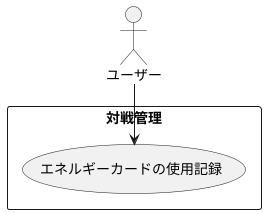

# エネルギーカードの使用記録

## 履歴

| バージョン |    日付    | 変更内容 | 担当者 |
| :--------: | :--------: | :------- | :----: |
|   0.0.1    | 2024/07/13 | 新規作成 |        |

## 詳細

### アクター

ユーザー

### 目的

ユーザーが各ターンに使用したエネルギーカードの情報を記録できるようにする。

### 事前条件

- ユーザーがアカウントにログインしている。
- ユーザーが新規対戦記録を開始している。
- ユーザーがターン開始を記録している。

### 事後条件

- 使用されたエネルギーカードの情報が対戦記録に保存される。

### トリガー

ユーザーがエネルギーカードを使用する。

### 主成功シナリオ

1. ユーザーが対戦記録画面にいる。
2. ユーザーがエネルギーカードを使用する。
3. ユーザーが「エネルギーカード使用記録」ボタンを押す。
4. アプリがユーザーにエネルギーカードの選択画面を表示する。
5. ユーザーが使用したエネルギーカードをリストから選択する。
6. ユーザーが「記録」ボタンを押す。
7. アプリが選択されたエネルギーカードの情報を検証する。
8. 入力内容が有効であれば、エネルギーカードの情報が対戦記録に保存される。
9. アプリがユーザーにエネルギーカード使用記録成功のメッセージを表示する。

### 代替フロー

- ***ユーザーがエネルギーカードの選択を変更する場合*** 
・5a. ユーザーが誤ってエネルギーカードを選択した場合、「キャンセル」ボタンを押して選択を取り消す。 
・5b. ユーザーが再度エネルギーカードを選択し、ステップ5に戻る。

### 例外フロー

- ***ネットワークエラーが発生した場合*** 
・8a. アプリがネットワークエラーを検出した場合、ユーザーにエラーメッセージを表示し、後で再試行するように促す。 
・8b. ユーザーが「キャンセル」ボタンを押してエネルギーカード使用記録プロセスを中止する。

## ユースケース図

