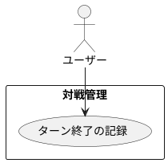

# ターン終了の記録

## 履歴

| バージョン |    日付    | 変更内容 | 担当者 |
| :--------: | :--------: | :------- | :----: |
|   0.0.1    | 2024/07/10 | 新規作成 |        |

## 詳細

### アクター

ユーザー

### 目的

ユーザーが各ターンの終了を記録し、ターンごとの時間を管理できるようにする。

### 事前条件

- ユーザーがアカウントにログインしている。
- ユーザーが新規対戦記録を開始している。
- ユーザーがターン開始を記録している。

### 事後条件

- ターンの終了時間が対戦記録に保存される。
- 各ターンにかかった時間が計算され、保存される。

### トリガー

ユーザーがターンを終了する。

### 主成功シナリオ

1. ユーザーが対戦記録画面にいる。
2. ユーザーが「ターン終了」ボタンを押す。
3. アプリが現在の時間を記録する。
4. アプリがターンの終了時間を対戦記録に保存する。
5. アプリがターンの開始時間と終了時間を使って、ターンにかかった時間を計算する。
6. アプリがターンにかかった時間を対戦記録に保存する。
7. アプリがユーザーにターン終了の記録成功のメッセージを表示する。
8. ユーザーが次のターンの記録を開始できる状態になる。

### 代替フロー

- ***ユーザーがターン終了を取り消す場合*** 
・2a. ユーザーが誤って「ターン終了」ボタンを押した場合、「キャンセル」ボタンを押してターン終了を取り消す。 
・2b. アプリがターン終了の記録をキャンセルし、対戦記録に影響を与えない。

### 例外フロー

- ***ネットワークエラーが発生した場合*** 
・4a. アプリがネットワークエラーを検出した場合、ユーザーにエラーメッセージを表示し、後で再試行するように促す。 
・4b. ユーザーが「キャンセル」ボタンを押してターン終了プロセスを中止する。

## ユースケース図

