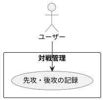

# 先攻・後攻の記録

## 履歴

| バージョン |    日付    | 変更内容 | 担当者 |
| :--------: | :--------: | :------- | :----: |
|   0.0.1    | 2024/07/10 | 新規作成 |        |

## 詳細

### アクター

ユーザー

### 目的

ユーザーが対戦開始時に先攻・後攻の情報を記録できるようにする。

### 前提条件

- ユーザーがアカウントにログインしている。
- ユーザーが新規対戦記録を開始している。

### 事後条件

- 先攻・後攻の情報が対戦記録に保存される。

### 主成功シナリオ

1. ユーザーが新規対戦記録の開始画面にいる。
2. アプリがユーザーに先攻・後攻の選択肢を表示する。
3. ユーザーが「先攻」または「後攻」のボタンを押す。
4. アプリが選択された情報を検証する。
5. 入力内容が有効であれば、先攻・後攻の情報を対戦記録に保存する。
6. アプリがユーザーに先攻・後攻の記録成功のメッセージを表示する。
7. ユーザーが対戦記録を続けるための次の画面に進む。

### 代替フロー

- ***ユーザーが選択を変更する場合*** 
・3a. ユーザーが選択を変更したい場合、再度「先攻」または「後攻」のボタンを押す。 
・3b. アプリが新しい選択を検証し、保存する。

### 例外フロー

- ***ネットワークエラーが発生した場合*** 
・5a. アプリがネットワークエラーを検出した場合、ユーザーにエラーメッセージを表示し、後で再試行するように促す。 
・5b. ユーザーが「キャンセル」ボタンを押して対戦記録プロセスを中止する。

## ユースケース図

