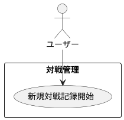

# 対戦の新規記録開始

## 履歴

| バージョン |    日付    | 変更内容 | 担当者 |
| :--------: | :--------: | :------- | :----: |
|   0.0.1    | 2024/07/05 | 新規作成 |        |

## 詳細

### アクター

ユーザー

### 目的

ユーザーが新しい対戦記録を開始し、対戦の詳細を記録できるようにする。

### 前提条件

- ユーザーがアカウントにログインしている。
- ユーザーが少なくとも1つのデッキを登録している。
- ユーザーが対戦相手を登録している。

### 事後条件

- 新しい対戦記録が開始され、対戦の詳細を記録できる状態になる。
- 対戦の初期情報（対戦相手、使用デッキ、先攻/後攻）が保存される。

### トリガー

ユーザーが「新規対戦記録」ボタンを押す。

### 主成功シナリオ

1. ユーザーがアプリの「対戦管理」画面を開く。
2. ユーザーが「新規対戦記録」ボタンを押す。
3. アプリがユーザーに対戦設定フォームを表示する。
4. ユーザーが以下の情報を入力する: 
・対戦相手の選択 
・使用するデッキの選択 
・先攻/後攻の選択 
5. ユーザーが「開始」ボタンを押す。
6. アプリが入力内容を検証する。
7. 入力内容が有効であれば、対戦記録を開始する。
8. アプリが対戦の初期情報をデータベースに保存する。
9. ユーザーが対戦の記録画面にリダイレクトされ、対戦の詳細を記録できる状態になる。

### 代替フロー

- ***入力内容が無効な場合*** 
・6a. アプリが入力内容の検証に失敗した場合、ユーザーにエラーメッセージを表示し、適切なフィールドを強調表示する。 
・6b. ユーザーがエラーメッセージに基づいて入力内容を修正する。 
・6c. ユーザーが再度「開始」ボタンを押し、ステップ6に戻る。

- ***デッキまたは対戦相手が登録されていない場合*** 
・4a. アプリがデッキまたは対戦相手の未登録を検出した場合、ユーザーにエラーメッセージを表示する。 
・4b. ユーザーが必要なデータを登録する。 
・4c. ユーザーが再度「新規対戦記録」ボタンを押し、ステップ4に戻る。

### 例外フロー

- ネットワークエラーが発生した場合 
・7a. アプリがネットワークエラーを検出した場合、ユーザーにエラーメッセージを表示し、後で再試行するように促す。 
・7b. ユーザーが「キャンセル」ボタンを押して対戦記録開始プロセスを中止する。

## ユースケース図

