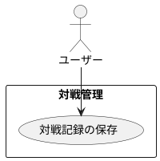

# 対戦記録の保存

## 履歴

| バージョン |    日付    | 変更内容 | 担当者 |
| :--------: | :--------: | :------- | :----: |
|   0.0.1    | 2024/07/13 | 新規作成 |        |

## 詳細

### アクター

ユーザー

### 目的

ユーザーが対戦の全体記録を保存し、後で振り返ることができるようにする。

### 事前条件

- ユーザーがアカウントにログインしている。
- ユーザーが新規対戦記録を開始している。
- ユーザーが対戦の詳細（ターンの開始・終了、サポートカードの使用、エネルギーカードの使用、勝敗など）を記録している。

### 事後条件

- 対戦記録がデータベースに保存され、ユーザーが後で参照できる。
- 対戦の全体記録が対戦履歴に追加される。

### トリガー

ユーザーが対戦を終了し、全体記録を保存する。

### 主成功シナリオ

1. ユーザーが対戦の全ての詳細を記録し終える。
2. ユーザーが「対戦記録の保存」ボタンを押す。
3. アプリがユーザーに対戦記録の確認画面を表示する。
4. ユーザーが記録内容を確認し、「保存」ボタンを押す。
5. アプリが対戦記録の全体を検証する。
6. 入力内容が有効であれば、対戦記録をデータベースに保存する。
7. アプリがユーザーに対戦記録保存成功のメッセージを表示する。
8. 対戦記録が対戦履歴に追加される。

### 代替フロー

- ***ユーザーが保存内容を変更する場合*** 
・4a. ユーザーが保存内容に誤りを見つけた場合、「編集」ボタンを押して対戦詳細を修正する。 
・4b. ユーザーが再度「保存」ボタンを押し、ステップ4に戻る。

### 例外フロー

- ***ネットワークエラーが発生した場合*** 
・6a. アプリがネットワークエラーを検出した場合、ユーザーにエラーメッセージを表示し、後で再試行するように促す。 
・6b. ユーザーが「キャンセル」ボタンを押して保存プロセスを中止する。

## ユースケース図

